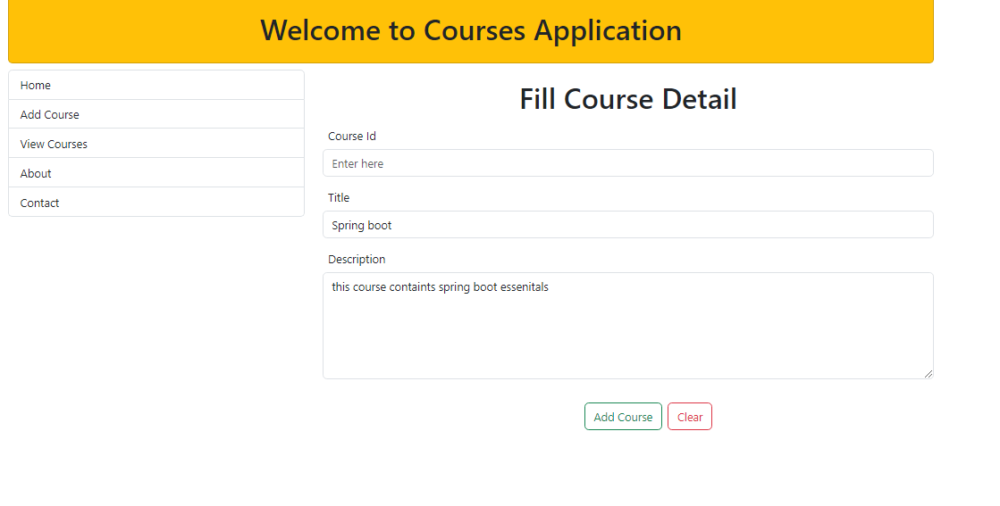
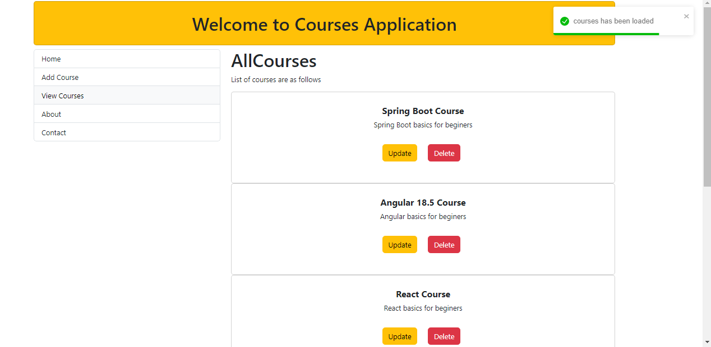
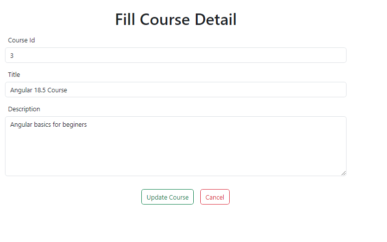
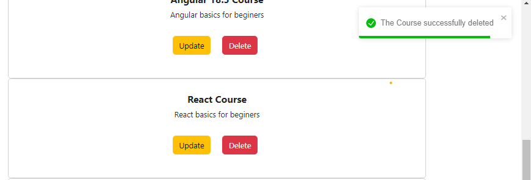

## Courses Project
Bu projede kurs ekleme,silme,güncelleme ve okuma işlemleri ele alınmıştır . 

backend için spring boot , frontend için React.js kullanılmiştır

backend'in kaynak koduna aşağıdaki linkten ulaşabilirsiniz:

[Backend-Link](https://github.com/Fettah-Koral/CoursesProjectBackend)

Kurs ekleme:

Kursları listelme:

Kursları güncellelme:

Kurs silme:

